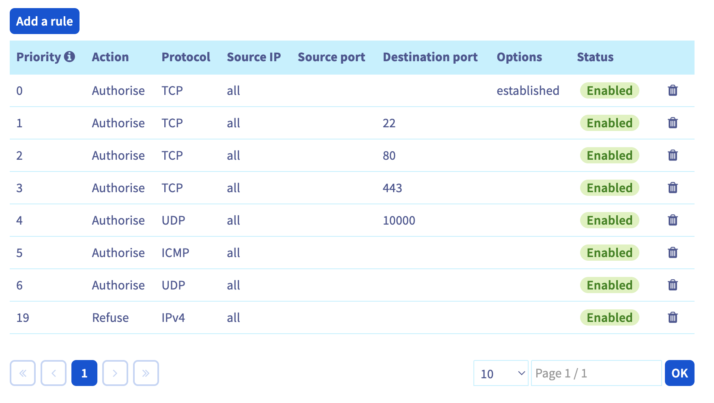

# OVH Info

> If your Discord bot isn't playing any sound, but its connecting to voice channels, this document may help you (especially if you are hosting your bot on OVH).

For hosting on OVH, you have to do some pretty bizarre firewall rule setups. Here are a few unfortunate things you need to know about OVH's firewall:

- Even if you disable the firewall, it will automatically turn on if OVH detects an "attack".
- The firewall does not apply its DDOS protection to any traffic that comes from within "OVH's network". This means that a user could just spin up a box on OVH and attack you from there, and OVH will not protect you from it.
- OVH only allows you to create about 20ish firewall rules. The rules do not allow you to select port ranges.

With all that being said, the network firewall that OVH provides is "meh" at best. Here is the exact network firewall set that I use on the OVH box that this Discord bot is hosted on (there are some other rules in here as well for other applications):

The rule with priority `6` in the screenshot above is what is important here. It effectively allows **all** UDP traffic on **any** port. This is critical because Discord bots that use voice communications (like this bot that connects to a server to play music) use UDP to communicate. The UDP ports that Discord uses for these connections vary between UDP ports 50,000 and 65,535. This means that you need to allow all UDP traffic on your OVH box in order for the bot to work. If you don't do this, the bot will join a voice channel but when you run a `/play` command, no sound will work at all.

From a security standpoint, the main takeaway here is that OVH's firewall is not very good. You should ultimately configure a firewall on your box (server) that is tightened down and harden the server box itself. Do not rely on OVH's firewall to protect you from network level attacks.
